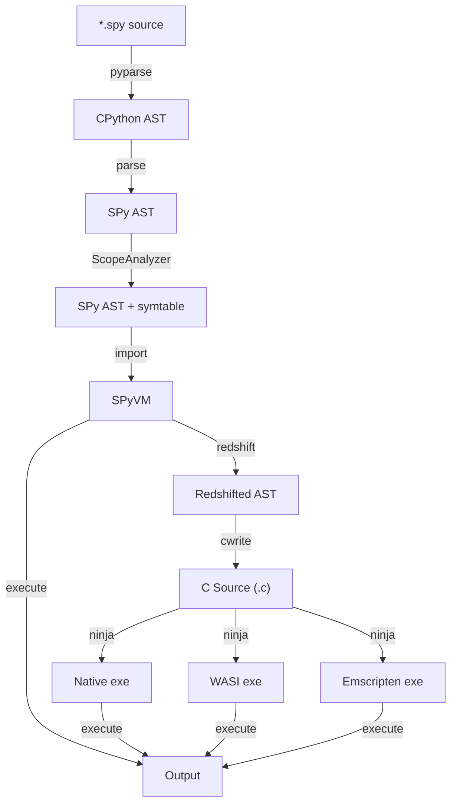

<div align="center">
  <!-- Disguised Face emoji from Noto Emoji by Google (Apache 2.0): https://github.com/googlefonts/noto-emoji -->
  <h1> SPy</h1>
</div>

**Discord server**
[](https://discord.gg/wRb29FGZpP)

**Community calls**: Monthly on the first Wednesday of the month at 17:30 CET (Europe time). [Google calendar](https://calendar.app.google/5qMsCibGVH8kAkcs7) and [Discord Event](https://discord.com/events/1378402660914429992/1433058515311919245)


## What is SPy?

TL;DR: SPy is a variant of Python specifically designed to be
statically compilable **while** retaining a lot of the "useful" dynamic parts
of Python.

It consists of:

  1. an interpreter (so that you can have the usual nice "development
     experience" that you have in Python)

  2. a compiler (for speed)

The documentation is very scarce at the moment, but the best source to
understand the ideas behind SPy are:

  - blog post [Inside SPy, part 1: Motivations and Goals](https://antocuni.eu/2025/10/29/inside-spy-part-1-motivations-and-goals/)

  - PyCon Italy 2025 talk: [slides](https://antocuni.eu/talk/2025/05/spy-pycon-italy/) and [recording](https://youtu.be/W-8tgZDgYmw).

  - PyCon US 2024 talk: [slides](https://antocuni.pyscriptapps.com/spy-pycon-2024/latest/) and [recording](https://www.youtube.com/watch?v=hnQ0oJ_yXlw&ab_channel=PyConUS).


Additional info can be found on:

  - Antonio Cuni's [blog](http://antocuni.eu/tags/#tag:spy)
  - [A peek into a possible future of Python in the browser](https://lukasz.langa.pl/f37aa97a-9ea3-4aeb-b6a0-9daeea5a7505/) by Łukasz Langa.

## Try it in your browser

Explore SPy without installing it by exploring the [playground](https://spylang.github.io/spy).

## Local development setup

At the moment, the only supported installation method for SPy is by doing an
"editable install" of the Git repo checkout.

The most up-to-date version of the requirements and the installation steps is the [GitHub action workflow](https://github.com/spylang/spy/blob/main/.github/workflows/tests.yml).

Prerequisites:

  - Python 3.12

Installation:

  1. Install the `spy` package in editable mode:
      ```
      $ cd /path/to/spy/
      $ pip install -e .[dev]
      ```

  2. Build the `libspy` runtime library:
     ```
     $ make -C spy/libspy
     ```

Run the test suite:

```
$ pytest
```

All the tests in `spy/tests/compiler/` are executed in three modes:

  - `interp`: run the SPy code via the interpreter
  - `doppler`: perform redshift, then run the redshifted code via the
    interpreter
  - `C`: generate C code, compile to WASM, then run it using `wasmtime`

## Basic usage examples

1. Execute a program in interpreted mode:
   ```
   $ spy examples/hello.spy
   Hello world!
   ```

2. Perform redshift and dump the generated source code:
   ```
   $ spy redshift examples/hello.spy
    def main() -> void:
        print_str('Hello world!')
    ```

3. Perform redshift and THEN execute the code:
   ```
   $ spy redshift -x examples/hello.spy
   Hello world!
   ```

4. Compile to executable:
   ```
   $ spy build examples/hello.spy --target native
   $ ./examples/build/hello
   Hello world!
   ```

## Inspecting compilation pipeline

Moreover, there are more flags to stop the compilation pipeline and inspect
the result at each phase.

The full compilation pipeline is:

  - `pyparse`: source code -> generate Python AST
  - `parse`: Python AST -> SPy AST
  - `symtable`: Analyze the SPy AST and produce a symbol table for each scope
  - `redshift`: SPy AST -> redshifted SPy AST
  - `cwrite`: redshifted SPy AST -> C code
  - `compile`: C code -> executable

Each step has a corresponding command line option which stops the
compiler at that stage and dumps human-readable results.

Examples:

```
$ spy pyparse examples/hello.spy
$ spy parse examples/hello.spy
$ spy symtable examples/hello.spy
$ spy redshift examples/hello.spy
$ spy build --cwrite examples/hello.spy
```

Moreover, the `execute` step performs the actual execution: it can happen
either after `symtable` (in "interp mode") or after `redshift` (in "doppler
mode").

## Implementation details

(The following section should probably moved to the docs, once we have them)

The following is a simplified diagram which represent the main phases of the
compilation pipeline:



### Role of WASM and libspy

WASM is a target (either WASI or emscripten), but it's also a fundamental
building block of the interpreter.  The interpreter is currently written in
Python and runs on top of CPython, but it also needs to be able to call into
`libspy` (see below). This is achieved by compiling `libspy` to WASM and load
it into the Python interpreter using `wasmtime`.

So, depending on the execution mode, `libspy` is used in two very different
ways:

- **interpreted**: loaded in the python process via wasmtime. This is what
  happens for `[interp]` and `[doppler]` tests, and when you do `spy hello.spy` or `spy execute hello.spy`.

- **compiled**: statically linked to the final executable. This is what happens
  for `[C]` tests and when you do `spy build hello.spy`.

**`libspy`**:

  - `spy/libspy/src` is a small runtime library written in C, which must be
    statically linked to any spy executable

  - `make -C spy/libspy` creates a `libspy.a` for each supported target, which
    currently are `native`, `emscripten` and `wasi`

  - `spy/libspy/__init__.py` contains some support code to be able to load the
    WASM version of libspy in the interpreter.

the code in `llwasm` is just a thin wrapper over `wasmtime` to make it nicer
to interact with it.

The code in `libspy/__init__.py` uses `llwasm` to load `libspy.wasm` in the
interpreter. In particular, it implements the necessary "WASM imports" which
`libspy` uses to call back into the interpreter, for example to print debug
log messages, to trigger a panic and to turn WASM panics into `SPyError`
exceptions.

### pyodide vs wasmtime

Normally, we execute SPy on top of CPython and we use `wasmtime` to load
`libspy.wasm`.

However, we can also run SPy on top of Pyodide: in that case, we are *already*
inside a WASM runtime engine (emscripten), so we don't need `wasmtime`.

The code in `llwasm` abstracts this difference away, and makes it possible to
transparently load `libspy.wasm` in either case.

## Contribution guidelines

If you want to contribute to SPy, be sure to review the [contribution guidelines](CONTRIBUTING.md)
