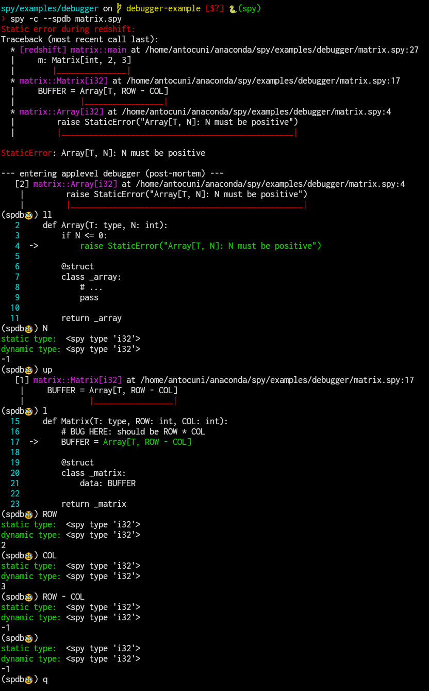

# Use spdb to debug compilation errors

This demo shows how you can use `--sdpb` to debug compilation errors and get a debugger
*in the middle of the compilation pipeline*.

## Step 0: C++ version

`matrix.cpp` contains a template `Matrix` class which wraps an `Array` class. The code
contains a bug:

```c++
template<typename T, int ROW, int COL>
struct Matrix {
    // BUG HERE: should be ROW * COL
    Array<T, ROW - COL> storage;
};
```

This is the compilation error given by `g++`; the culprit line is not even show:

```
❯ g++ -std=c++17 -Wall -Wextra matrix.cpp
matrix.cpp: In instantiation of ‘struct Array<int, -1>’:
matrix.cpp:12:25:   required from ‘struct Matrix<int, 2, 3>’
matrix.cpp:16:23:   required from here
matrix.cpp:5:21: error: static assertion failed: Array<T, N>: N must be positive
    5 |     static_assert(N > 0, "Array<T, N>: N must be positive");
      |                   ~~^~~
matrix.cpp:5:21: note: the comparison reduces to ‘(-1 > 0)’
matrix.cpp:6:7: error: size ‘18446744073709551615’ of array exceeds maximum object size ‘9223372036854775807’
    6 |     T data[N];
      |       ^~~~
```

`clang` does a bit better, but for more complex code it might not be immediately obvious
where the negative number comes from:

```
❯ clang++-20 -std=c++17 -Wall -Wextra matrix.cpp
matrix.cpp:5:19: error: static assertion failed due to requirement '-1 > 0': Array<T, N>: N must be positive
    5 |     static_assert(N > 0, "Array<T, N>: N must be positive");
      |                   ^~~~~
matrix.cpp:12:25: note: in instantiation of template class 'Array<int, -1>' requested here
   12 |     Array<T, ROW - COL> storage;
      |                         ^
matrix.cpp:16:23: note: in instantiation of template class 'Matrix<int, 2, 3>' requested here
   16 |     Matrix<int, 2, 3> m;
      |                       ^
1 error generated.
```

## Step 1: SPy version

`matrix.spy` contains the equivalent code in SPy. When we try to compile it, we get an error similar to `clang`:

```
❯ spy -c matrix.spy
Static error during redshift:
Traceback (most recent call last):
  * [redshift] matrix::main at /home/antocuni/anaconda/spy/examples/debugger/matrix.spy:27
  |     m: Matrix[int, 2, 3]
  |        |_______________|
  * matrix::Matrix[i32] at /home/antocuni/anaconda/spy/examples/debugger/matrix.spy:17
  |     BUFFER = Array[T, ROW - COL]
  |              |_________________|
  * matrix::Array[i32] at /home/antocuni/anaconda/spy/examples/debugger/matrix.spy:4
  |         raise StaticError("Array[T, N]: N must be positive")
  |         |__________________________________________________|

StaticError: Array[T, N]: N must be positive
```

## Step 2: SPdb

With `--sdpb` we can get a debugger in the point which causes the compilation to fail:

```
❯ spy -c --spdb matrix.spy
Static error during redshift:
Traceback (most recent call last):
  * [redshift] matrix::main at /home/antocuni/anaconda/spy/examples/debugger/matrix.spy:27
  |     m: Matrix[int, 2, 3]
  |        |_______________|
  * matrix::Matrix[i32] at /home/antocuni/anaconda/spy/examples/debugger/matrix.spy:17
  |     BUFFER = Array[T, ROW - COL]
  |              |_________________|
  * matrix::Array[i32] at /home/antocuni/anaconda/spy/examples/debugger/matrix.spy:4
  |         raise StaticError("Array[T, N]: N must be positive")
  |         |__________________________________________________|

StaticError: Array[T, N]: N must be positive

--- entering applevel debugger (post-mortem) ---
   [2] matrix::Array[i32] at /home/antocuni/anaconda/spy/examples/debugger/matrix.spy:4
    |         raise StaticError("Array[T, N]: N must be positive")
    |         |__________________________________________________|
(spdb🥸)
```

We can inspect the source code and the value of N:

```
(spdb🥸) ll
   2     def Array(T: type, N: int):
   3         if N <= 0:
   4  ->         raise StaticError("Array[T, N]: N must be positive")
   5
   6         @struct
   7         class _array:
   8             # ...
   9             pass
  10
  11         return _array
(spdb🥸) N
static type:  <spy type 'i32'>
dynamic type: <spy type 'i32'>
-1
```

We can go `up` in the call stack and inspect the values which caused the error:

```
(spdb🥸) up
   [1] matrix::Matrix[i32] at /home/antocuni/anaconda/spy/examples/debugger/matrix.spy:17
    |     BUFFER = Array[T, ROW - COL]
    |              |_________________|
(spdb🥸) l
  15     def Matrix(T: type, ROW: int, COL: int):
  16         # BUG HERE: should be ROW * COL
  17  ->     BUFFER = Array[T, ROW - COL]
  18
  19         @struct
  20         class _matrix:
  21             data: BUFFER
  22
  23         return _matrix
(spdb🥸) ROW
static type:  <spy type 'i32'>
dynamic type: <spy type 'i32'>
2
(spdb🥸) COL
static type:  <spy type 'i32'>
dynamic type: <spy type 'i32'>
3
(spdb🥸) ROW - COL
static type:  <spy type 'i32'>
dynamic type: <spy type 'i32'>
-1
```

The following is a colorful version of the debugging session above:


